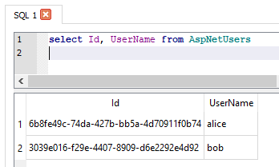
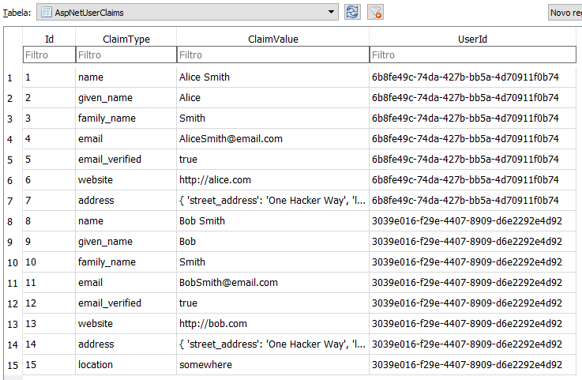

# Da Parte 2 para a Parte 3: diferenças

Começamos a parte 3 deste curso com o código que usamos no final último curso,
**ASP.NET Core parte 2: Um e-Commerce com MVC e EF Core** (https://cursos.alura.com.br/course/aspnet-core-2-validacoes-seguranca)

Porém, algumas alterações e atualizações foram necessárias.

**Melhorias**:
1. Todos os métodos de bancos de dados ou E/S agora são assíncronos
2. Nova view de busca de produtos
3. O modelo agora tem categorias de Produtos
4. Arquivo `models.cs` foi quebrado em vários arquivos, um para cada entidade
5. Repositórios foram simplificados: `CategoriaRepository` foi para `ProdutoRepository` e `ItemPedidoRepository` foi para `PedidoRepository`.
6. Fizemos a atualização dos pacotes para ASP.NET Core 2.2

# Item01 - Criando o Projeto IdentityServer4

## Introdução

Nesta parte 3 do curso, iremos utilizar um sistema de login e garantir que nossa aplicação seja acessada apenas por usuários autenticados.

Também vamos utilizar nossa web app em conjunto com um novo projeto web api simples.

Se você só precisa de uma tabela de usuários com recursos de login de senha e um perfil de usuário, então **ASP.NET Identity** é a melhor opção para você.

A Alura já possui os cursos abaixo, que utilizam ASP.NET Identity para deixar suas aplicações seguras:

* **ASP.NET Identity parte 1: Gerencie contas de usuários**
(https://www.alura.com.br/curso-online-csharp-aspnet-identity-pt1)

* **ASP.NET Identity parte 2: Autenticação, segurança com lockout**
(https://www.alura.com.br/curso-online-csharp-aspnet-identity-pt2)

* **ASP.NET Identity parte 3: Autorização, autenticação externa com redes sociais**
(https://www.alura.com.br/curso-online-csharp-aspnet-identity-pt3)

* **ASP.NET Identity parte 4: Autenticação mais segura com 2 fatores**
(https://www.alura.com.br/curso-online-csharp-aspnet-identity-pt4)

Entretanto, se você tiver múltiplos clientes, que precisam acessar diferentes web APIs, você poderá utilizar um **servidor de token de segurança (STS)** para proteger e validar tokens de identidade e acesso entre os serviços.

Por esse motivo, iremos utilizar IdentityServer4 como uma **autoridade externa de login**. Dessa forma, a mesma autenticação e autorização funcionarão tanto para a web app quanto para as web apis.


Algumas características do **IdentityServer4** são:

- **Autenticação como serviço**:
Lógica de login e fluxo de trabalho centralizados para todos os seus aplicativos (web, nativo, móvel, serviços). O IdentityServer é uma implementação oficialmente certificada do OpenID Connect.
- **Single Sign-on / Sign-out**:
Logon e logout único em vários tipos de aplicativos.
- **Controle de acesso para APIs**:
Emitir tokens de acesso para APIs para vários tipos de clientes, por exemplo servidor para servidor, aplicativos da Web, SPAs e aplicativos nativos / móveis.
- **Gateway de Federação**:
Suporte para provedores de identidade externos, como o Azure Active Directory, o Google, o Facebook, etc. Isso protege seus aplicativos dos detalhes de como conectar-se a esses provedores externos.
- **Foco na personalização**:
A parte mais importante - muitos aspectos do IdentityServer podem ser personalizados para atender às suas necessidades. Como o IdentityServer é uma estrutura e não um produto em caixa ou um SaaS, você pode escrever código para adaptar o sistema da maneira que fizer sentido para seus cenários.
- **Open Source Maduro**:
O IdentityServer usa a licença permissiva do Apache 2, que permite criar produtos comerciais sobre ela. Também faz parte da Fundação .NET, que fornece governança e suporte legal.

## O Novo Projeto CasaDoCodigo.Identity

Os passos abaixo são necessários para criar um novo projeto **IdentityServer4**:

- Copiar o projeto "CasaDoCodigo" da pasta **antes** para **Item01**

- Abrir Developer Command Prompt for VS 2017

- Ir para a pasta Item01:

```
cd **ASPNETCore2-Parte3\Item01**
```

- Criar a pasta **CasaDoCodigo.Identity**

```
md CasaDoCodigo.Identity
```

- Mudar para a pasta **CasaDoCodigo.Identity**

```
cd CasaDoCodigo.Identity
```

- Instalar templates IdentityServer4

```
dotnet new -i identityserver4.templates
```

- Criar novo projeto ASP.NET Identity for user management:


```
\ASPNETCore2-Parte3\Item01\CasaDoCodigo.Identity>dotnet new is4aspid
```

> O modelo "IdentityServer4 with ASP.NET Core Identity" foi criado com êxito.
>
> Processando ações de pós-criação...
O modelo está configurado para executar a seguinte ação:
Descrição:
Instruções manuais: Seeds the initial user database
Comando real: dotnet run /seed
Deseja executar esta ação (S|N)?
Y
Executando o comando 'dotnet run /seed'...
O comando foi bem-sucedido.

- Adicionar o novo projeto à solução, na pasta Item01

- Mudar o endereço para http://localhost:5000

- Definir 2 projetos iniciais: \Item01\CasaDoCodigo e \Item01\CasaDoCodigo.Identity.

- Executar os 2 projetos

- Fazer login como **Alice Smith** e **Bob Smith**

# Item02 - Autorizando o Cliente MVC

```csharp
public static class Config
{
    public static IEnumerable<IdentityResource> GetIdentityResources()
    {
        return new IdentityResource[]
        {
            new IdentityResources.OpenId(),
            new IdentityResources.Profile(),
        };
    }

    public static IEnumerable<ApiResource> GetApis()
    {
        return new ApiResource[]
        {
            new ApiResource("api1", "My API #1")
        };
    }

    public static IEnumerable<Client> GetClients()
    {
        return new[]
        {
            // client credentials flow client
            new Client
            {
                ClientId = "client",
                ClientName = "Client Credentials Client",

                AllowedGrantTypes = GrantTypes.ClientCredentials,
                ClientSecrets = { new Secret("511536EF-F270-4058-80CA-1C89C192F69A".Sha256()) },

                AllowedScopes = { "api1" }
            },

            // MVC client using hybrid flow
            new Client
            {
                ClientId = "mvc",
                ClientName = "MVC Client",

                AllowedGrantTypes = GrantTypes.HybridAndClientCredentials,
                ClientSecrets = { new Secret("49C1A7E1-0C79-4A89-A3D6-A37998FB86B0".Sha256()) },

                RedirectUris = { "http://localhost:5001/signin-oidc" },
                FrontChannelLogoutUri = "http://localhost:5001/signout-oidc",
                PostLogoutRedirectUris = { "http://localhost:5001/signout-callback-oidc" },

                AllowOfflineAccess = true,
                AllowedScopes = { "openid", "profile", "api1" }
            },

            // SPA client using implicit flow
            new Client
            {
                ClientId = "spa",
                ClientName = "SPA Client",
                ClientUri = "http://identityserver.io",

                AllowedGrantTypes = GrantTypes.Implicit,
                AllowAccessTokensViaBrowser = true,

                RedirectUris =
                {
                    "http://localhost:5002/index.html",
                    "http://localhost:5002/callback.html",
                    "http://localhost:5002/silent.html",
                    "http://localhost:5002/popup.html",
                },

                PostLogoutRedirectUris = { "http://localhost:5002/index.html" },
                AllowedCorsOrigins = { "http://localhost:5002" },

                AllowedScopes = { "openid", "profile", "api1" }
            }
        };
    }
}
```


```csharp
public class Startup
{
    public IConfiguration Configuration { get; }
    public IHostingEnvironment Environment { get; }

    public Startup(IConfiguration configuration, IHostingEnvironment environment)
    {
        Configuration = configuration;
        Environment = environment;
    }

    public void ConfigureServices(IServiceCollection services)
    {
        services.AddDbContext<ApplicationDbContext>(options =>
            options.UseSqlite(Configuration.GetConnectionString("DefaultConnection")));

        services.AddIdentity<ApplicationUser, IdentityRole>()
            .AddEntityFrameworkStores<ApplicationDbContext>()
            .AddDefaultTokenProviders();

        services.AddMvc().SetCompatibilityVersion(Microsoft.AspNetCore.Mvc.CompatibilityVersion.Version_2_1);

        services.Configure<IISOptions>(iis =>
        {
            iis.AuthenticationDisplayName = "Windows";
            iis.AutomaticAuthentication = false;
        });

        var builder = services.AddIdentityServer(options =>
        {
            options.Events.RaiseErrorEvents = true;
            options.Events.RaiseInformationEvents = true;
            options.Events.RaiseFailureEvents = true;
            options.Events.RaiseSuccessEvents = true;
        })
            .AddInMemoryIdentityResources(Config.GetIdentityResources())
            .AddInMemoryApiResources(Config.GetApis())
            .AddInMemoryClients(Config.GetClients())
            .AddAspNetIdentity<ApplicationUser>();

        if (Environment.IsDevelopment())
        {
            builder.AddDeveloperSigningCredential();
        }
        else
        {
            throw new Exception("need to configure key material");
        }

        services.AddAuthentication()
            .AddGoogle(options =>
            {
                // register your IdentityServer with Google at https://console.developers.google.com
                // enable the Google+ API
                // set the redirect URI to http://localhost:5000/signin-google
                options.ClientId = "copy client ID from Google here";
                options.ClientSecret = "copy client secret from Google here";
            });
    }

    public void Configure(IApplicationBuilder app)
    {
        if (Environment.IsDevelopment())
        {
            app.UseDeveloperExceptionPage();
            app.UseDatabaseErrorPage();
        }
        else
        {
            app.UseExceptionHandler("/Home/Error");
        }

        app.UseStaticFiles();
        app.UseIdentityServer();
        app.UseMvcWithDefaultRoute();
    }
}

```






# Item03 - Fluxo de Logout

# Item04 - Pedidos de Clientes

# Item05 - Autorizando WebAPI

