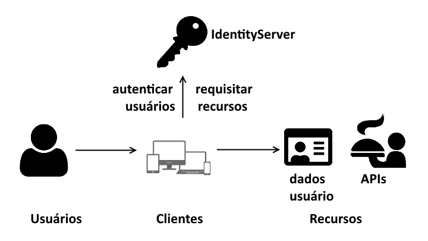
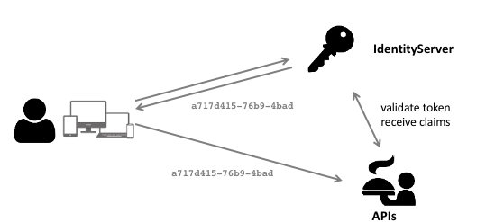

# Instalação

- Visual Studio Community
https://visualstudio.microsoft.com/pt-br/vs/community/

- DB Browser for SQLite
https://sqlitebrowser.org/blog/version-3-11-1-released

- Postman
https://www.getpostman.com/downloads/


# Da Parte 2 para a Parte 3: diferenças

PROBLEMA PRÁTICO : fazer uma "pré-introdução", para orientar estudantes vindos do último curso (Parte 2)
SOLUÇÃO PRÁTICA : Mostrar as alterações feitas no projeto inicial da Parte 3
ABSTRAÇÃO DO PROBLEMA PRÁTICO EM TEORIA : introduzir assincronia, busca de produtos, refatoração no modelo simplificação nos repositórios. Atualização do framework.
ABSTRAÇÃO DA SOLUÇÃO EM TEORIA : 

Começamos a parte 3 deste curso com o código que usamos no final último curso,
**ASP.NET Core parte 2: Um e-Commerce com MVC e EF Core** 
(https://cursos.alura.com.br/course/aspnet-core-2-validacoes-seguranca)

Porém, algumas alterações e atualizações foram necessárias.

**Melhorias**:
1. Todos os métodos de bancos de dados ou E/S agora são assíncronos
2. Nova view de busca de produtos
3. O modelo agora tem categorias de Produtos
4. Arquivo `models.cs` foi quebrado em vários arquivos, um para cada entidade
5. Repositórios foram simplificados: `CategoriaRepository` foi para `ProdutoRepository` e `ItemPedidoRepository` foi para `PedidoRepository`.
6. Os dados iniciais agora são carregados no `Program.cs`
7. Projeto atualizado para ASP.NET Core 2.2

# Item01 - Criando o Projeto IdentityServer4

## Introdução

Nesta parte 3 do curso, iremos utilizar um sistema de login e garantir que nossa aplicação seja acessada apenas por usuários autenticados.

Também vamos utilizar nossa web app em conjunto com um novo projeto web api simples.

Se você só precisa de uma tabela de usuários com recursos de login de senha e um perfil de usuário, então **ASP.NET Identity** é a melhor opção para você.

A Alura já possui os cursos abaixo, que utilizam ASP.NET Identity para deixar suas aplicações seguras:

**PARA SABER MAIS (INCLUIR COMO SLIDES E COMO ATIVIDADE NA PLATAFORMA):**


* **ASP.NET Identity parte 1: Gerencie contas de usuários**
(https://www.alura.com.br/curso-online-csharp-aspnet-identity-pt1)


* **ASP.NET Identity parte 2: Autenticação, segurança com lockout**
(https://www.alura.com.br/curso-online-csharp-aspnet-identity-pt2)


* **ASP.NET Identity parte 3: Autorização, autenticação externa com redes sociais**
(https://www.alura.com.br/curso-online-csharp-aspnet-identity-pt3)


* **ASP.NET Identity parte 4: Autenticação mais segura com 2 fatores**
(https://www.alura.com.br/curso-online-csharp-aspnet-identity-pt4)

Entretanto, se você tiver múltiplos clientes, que precisam acessar diferentes web APIs, você poderá utilizar um **servidor de token de segurança (STS)** para proteger e validar tokens de identidade e acesso entre os serviços.

Por esse motivo, iremos utilizar IdentityServer4 como uma **autoridade externa de login**. Dessa forma, a mesma autenticação e autorização funcionarão tanto para a web app quanto para as web apis.


Algumas características do **IdentityServer4** são:





- **Autenticação como serviço**:
Lógica de login e fluxo de trabalho centralizados para todos os seus aplicativos (web, nativo, móvel, serviços). O IdentityServer é uma implementação oficialmente certificada do OpenID Connect.


- **Single Sign-on / Sign-out**:
Logon e logout único em vários tipos de aplicativos.


- **Controle de acesso para APIs**:
Emitir tokens de acesso para APIs para vários tipos de clientes, por exemplo servidor para servidor, aplicativos da Web, SPAs e aplicativos nativos / móveis.


- **Gateway de Federação**:
Suporte para provedores de identidade externos, como o Azure Active Directory, o Google, o Facebook, etc. Isso protege seus aplicativos dos detalhes de como conectar-se a esses provedores externos.


- **Foco na personalização**:
A parte mais importante - muitos aspectos do IdentityServer podem ser personalizados para atender às suas necessidades. Como o IdentityServer é uma estrutura e não um produto em caixa ou um SaaS, você pode escrever código para adaptar o sistema da maneira que fizer sentido para seus cenários.


- **Open Source Maduro**:
O IdentityServer usa a licença permissiva do Apache 2, que permite criar produtos comerciais sobre ela. Também faz parte da Fundação .NET, que fornece governança e suporte legal.

## O Novo Projeto CasaDoCodigo.Identity

Os passos abaixo são necessários para criar um novo projeto **IdentityServer4**:

- Copiar o projeto "CasaDoCodigo" da pasta **antes** para **Item01**

- Abrir Developer Command Prompt for VS 2017

- Ir para a pasta Item01:

```
cd **ASPNETCore2-Parte3\Item01**
```

- Criar a pasta **CasaDoCodigo.Identity**

```
md CasaDoCodigo.Identity
```

- Mudar para a pasta **CasaDoCodigo.Identity**

```
cd CasaDoCodigo.Identity
```

- Instalar templates IdentityServer4

```
dotnet new -i identityserver4.templates
```

- Criar novo projeto ASP.NET Identity for user management:


```
\ASPNETCore2-Parte3\Item01\CasaDoCodigo.Identity>dotnet new is4aspid
```

> O modelo "IdentityServer4 with ASP.NET Core Identity" foi criado com êxito.
>
> Processando ações de pós-criação...
O modelo está configurado para executar a seguinte ação:
Descrição:
Instruções manuais: Seeds the initial user database
Comando real: dotnet run /seed
Deseja executar esta ação (S|N)?
Y
Executando o comando 'dotnet run /seed'...
O comando foi bem-sucedido.

- Adicionar o novo projeto à solução, na pasta Item01

- Mudar o endereço do projeto Identity para http://localhost:5000

- Mudar o endereço do projeto MVC para http://localhost:5001

- Mudar o nome do projeto MVC para CasaDoCodigo.MVC

- Definir 2 projetos iniciais: \Item01\CasaDoCodigo e \Item01\CasaDoCodigo.Identity.

- Executar os 2 projetos

- Fazer login como **Alice Smith** e **Bob Smith**


Uma vez logado, o usuário visualiza seu nome no topo da página.


Aqui, ele pode fazer o logout, como podemos ver:


# Item02 - Autorizando o Cliente MVC

## Protegendo recursos

Agora que temos o projeto Identity, começaremos a proteger nosso projeto MVC contra acesso não-autenticado.
Com isso, garantiremos que somente usuários que entraram com login e senha válidos possam ter acesso a recursos protegidos do sistema.

Mas quais recursos deverão ser protegidos?

|Action|Protegido?|
|--|--|
|Carrossel|NÃO|
|BuscaProdutos|NÃO|
|Carrinho|SIM|
|Cadastro|SIM|
|Resumo|SIM|
|UpdateQuantidade|SIM|

Note que tanto a Carrossel e BuscaProdutos ficarão desprotegidos.
Por quê? Queremos permitir que usuários possam navegar pela busca de produtos do site livremente, sem obrigá-los a fazer login com a senha.
Já os outros actions são todas protegidas, pois envolvem a manipulação de pedidos, que só podem ser feito por clientes.

Como protegeremos esses recursos? Devemos marcar cada action com um atributo de autorização:

```csharp
[Authorize]
public async Task<IActionResult> Carrinho(string codigo)
```

> O atributo `[Authorize]` especifica que o acesso a um controlador ou método de ação é restrito a usuários que atendem ao requisito de autorização.

Agora que marcamos a autorização, rodamos a solução...

A página inicial da aplicação é a busca de produtos, como podemos ver,
que é acessada pela action `BuscaProdutos`. Note que não exigimos autorização nessa action.


Agora vamos clicar para adicionar um produto qualquer...

> An unhandled exception occurred while processing the request.
InvalidOperationException: No authenticationScheme was specified, and there was no DefaultChallengeScheme found.
Microsoft.AspNetCore.Authentication.AuthenticationService+<ChallengeAsync>d__11.MoveNext()

Por que recebemos esse erro? 

Até agora, só dissemos quais actions são autorizadas, porém não definimos o **esquema de autenticação**. 

Lembre-se de que a action que estamos tentando acessar, `Carrinho`, é protegida pelo atributo `[Authorize]`.

Vamos fazer isso agora. Mas antes, precisamos entender os papéis desempenhados por cada
componente nesta arquitetura.

Como vemos na imagem abaixo, o projeto com **IdentityServer4**
pode ser usado pelos clientes e outros serviços, para garantir a segurança 
de um sistema.

**Clientes**: app móvel, web app, single page application, etc.
que exige que o usuário seja autenticado para acessar determinados recursos.
**IdentityServer4**: servidor de token de segurança. Possui a view para login do usuário. 
**Relatório Web API**: serviço restrito, que só pode ser acessado por usuários autenticados.


O projeto **IdentityServer4** possui um arquivo `Config.cs`, onde podemos configurar os **clientes**, **apis** e **recursos** usados no fluxo de autenticação/autorização.

Vamos modificar somente o **cliente ** para definir o id e nome do cliente (projeto CasaDoCódigo.MVC)

**arquivo Config.cs (CasaDoCodigo.Identity)**
```csharp
// MVC client using hybrid flow
new Client
{
    ClientId = "CasaDoCodigo.MVC",
    ClientName = "Casa do Código MVC",
```

Essa área define quais são os clientes autorizados pelo projeto IdentityServer4.

Agora precisamos modificar o projeto MVC para habilitar autenticação.

Podemos dizer que o serviço de autenticação é um **middleware**.

> O middleware é um software que fornece serviços para aplicações além das já são oferecidas pelo sistema operacional.

**arquivo Startup.cs (CasaDoCodigo.MVC)**
```csharp
public void ConfigureServices(IServiceCollection services)
{
    //...
    services.AddAuthorization();
    //...
}
public void Configure(IApplicationBuilder app, IHostingEnvironment env, IServiceProvider serviceProvider)
{
    //...
    app.UseAuthentication();
    //...
}
```

Os métodos `AddAuthorization` e `UseAuthentication` acrescentam o **middleware** de autorização e autenticação no **pipeline** da aplicação web.

Agora também precisamos adicionar o **esquema de autenticação**. 

Esse esquema necessita de 2 informações:

- O esquema **default**: vamos usar cookies
- O esquema de **"desafio" default**: vamos usar OpenId 

```csharp
services
.AddAuthentication(options =>
{
    options.DefaultScheme = CookieAuthenticationDefaults.AuthenticationScheme;
    options.DefaultChallengeScheme = OpenIdConnectDefaults.AuthenticationScheme;
});
```

Para utilizar esses defaults, instale o pacote no projeto MVC:
```
PM>Install-Package Microsoft.AspNetCore.Authentication.Cookies
```

Agora precisamos dizer ao ASP.NET Core para utilizar **cookies** durante a autenticação:

```csharp
.AddCookie();
```

A seguir, vamos configurar o sistema de identificação **OpenId** :

- **SignInScheme**: o esquema para fazer o login (por cookies)
- **Authority**: a "autoridade", ou seja, o endereço do serviço do IdentityServer
- **ClientId**: o Id do cliente (CasaDoCodigo.MVC)
- **ClientSecret**: o segredo da autenticação (usamos o mesmo do serviço identity)
- **ResponseType**: precisa requisitar um código de autorização e um token de identidade
- **RequireHttpsMetadata**: vamos dispensar a necessidade de HTTPS, pois estamos em modo de desenvolvimento

```csharp
.AddOpenIdConnect(options =>
{
    options.SignInScheme = CookieAuthenticationDefaults.AuthenticationScheme;
    options.Authority = "http://localhost:5000";
    options.ClientId = "CasaDoCodigo.MVC";
    options.ClientSecret = "49C1A7E1-0C79-4A89-A3D6-A37998FB86B0";
    options.ResponseType = "code id_token";
    options.RequireHttpsMetadata = false;
});
```

Agora que fizemos a configuração do cliente de autenticação, rodamos a solução novamente...


Como sabemos, a action `BuscaProdutos` não é protegida por autorização.

Agora tentaremos adicionar um produto ao carrinho.

Isso nos levará para o endereço do serviço STS (IdentityServer4):


Neste momento, podemos fazer login com 2 usuários predeterminados:

- **login**: alice, **senha**: Pass123$
- **login**: bob, **senha**: Pass123$

Ao aceitarmos o login, a aplicação IdentityServer nos leva para uma 
outra view, onde o usuário pode visualizar as informações 
que são solicitadas pela aplicação CasaDoCodigo.MVC.

Aqui, ele tem a oportunidade de negar permissão a esse acesso.


Ao conceder a permimissão, você é redirecionado de volta para
a aplicação cliente (CasaDoCodigo.MVC):


Vamos dar uma olhada na aba "network" da aplicação cliente após o login:


Note como a aplicação está utilizando vários cookies.
Esses cookies são necessários para várias finalidades, como:

- token anti-falsificação
- "lembrar" quem é o usuário logado,
- quais são suas informações,
- data/hora de expiração, 
- sessão do IdentityServer, etc.

Na outra página, vamos dar uma olhada neste link, que exibirá os "grants", isto é,
as "concessões" que foram dadas à aplicação cliente:


Você pode facilmente interromper o uso dos seus dados pela aplicação, deslogando
na aplicação IdentityServer:


Agora vamos abrir novamente a aba "network" do navegador, para ver quais cookies estão sendo usados
pela aplicação cliente:


Podemos notar que "sumiram" 3 cookies desde nossa última visita a essa aba:

- .AspNetCore.Cookies
- .AspNetCore.Identity.Application
- idsrv.session

Sem esses cookies, o mecanismo de autenticação considera que o usuário está "deslogado", portanto
da próxima vez que ele tentar acessar o carrinho, será solicitado um novo login.

Vamos dar uma olhada no caminho desde a página inicial a até a aplicação ser autenticada:


# Item03 - Fluxo de Logout

## CasaDoCodigo.Identity

Neste ponto, o endereço do nosso cliente (CasaDoCodigo.MVC) está fixo
na configuração de clientes do projeto Identity:

```csharp
RedirectUris = { "http://localhost:5001/signin-oidc" },
FrontChannelLogoutUri = "http://localhost:5001/signout-oidc",
PostLogoutRedirectUris = { "http://localhost:5001/signout-callback-oidc" },
```

E você quiser, ou precisar mudar o endereço desse cliente? Você teria que alterar e recompilar o código.

Então é melhor deixar essa informação configurável.

Vamos adicionar uma configuração nova para o "endereço de retorno":

(arquivo appsettings.json)
```
"CallbackUrl": "http://localhost:5001"
```

Esse "CallbackUrl" é o endereço-base para o cliente MVC do IdentityServer

Agora é necessário modificar o código para injetar o parametro de url de callback:

(arquivo Startup.cs)
```csharp
.AddInMemoryClients(Config.GetClients(Configuration["CallbackUrl"]))
```

```csharp
RedirectUris = { callbackUrl + "/signin-oidc" },
FrontChannelLogoutUri = callbackUrl + "/signout-oidc",
PostLogoutRedirectUris = { callbackUrl + "/signout-callback-oidc" },
```

## CasaDoCodigo.MVC

- Instalar IdentityModel

(arquivo appsettings.json)
```
  "IdentityUrl": "http://localhost:5000",
  "CallbackUrl": "http://localhost:5001"
```

(arquivo PedidoController.cs)
```csharp
[Authorize]
public async Task Logout()
{
    await HttpContext.SignOutAsync(CookieAuthenticationDefaults.AuthenticationScheme);
    await HttpContext.SignOutAsync(OpenIdConnectDefaults.AuthenticationScheme);
}
```

(arquivo _Layout.cshtml)
```csharp
@using IdentityServer4.Extensions
@{
    string name = null;
    if (!true.Equals(ViewData["signed-out"]))
    {
        name = Context.User?.GetDisplayName();
    }
}
```

```html
@if (!string.IsNullOrWhiteSpace(name))
{
    <ul class="nav navbar-nav">
        <li class="dropdown">
            <a href="#" class="dropdown-toggle" data-toggle="dropdown">@name <b class="caret"></b></a>
            <ul class="dropdown-menu">
                <li><a asp-action="Logout" asp-controller="Account">Logout</a></li>
            </ul>
        </li>
    </ul>
}
```

Porém, quando rodamos a solução, não estamos vendo a informação do usuário logado:


Por quê?

Primeiro, vamos fazer logout com a aplicação Identity.

Agora, vamos modificar o arquivo de layout do nosso site.

(arquivo _Layout.cshtml)
```csharp
@using System.Linq;
@using System.Security.Claims;
@{
    string name = null;
    if (!true.Equals(ViewData["signed-out"]))
    {
        name = @User.FindFirst("name")?.Value;
    }
}
```

```csharp
Context.User.Claims.ToList()
Count = 4
    [0]: {sid: a7a7a086af6a1ae87c682638a80824c1}
    [1]: {http://schemas.xmlsoap.org/ws/2005/05/identity/claims/nameidentifier: 5f1aaf2e-3f22-467b-bd96-60a5cd4ec095}
    [2]: {http://schemas.microsoft.com/identity/claims/identityprovider: local}
    [3]: {http://schemas.microsoft.com/claims/authnmethodsreferences: pwd}
```

Precisamos marcar esta opção na configuração do cliente:
```csharp
options.GetClaimsFromUserInfoEndpoint = true;
```

A propriedade `GetClaimsFromUserInfoEndpoint` define se o manipulador 
deve ir até o endpoint de informações do usuário para recuperar declarações 
adicionais ou não após criar uma identidade a partir do id_token recebido do 
endpoint do token. O padrão é falso'.

Consultando novamente os claims do usuário, obtemos uma nova lista:

```csharp
Context.User.Claims.ToList()
Count = 6
    [0]: {sid: 7005c6b234f0e3db4f829e6e5631e35b}
    [1]: {sub: 5f1aaf2e-3f22-467b-bd96-60a5cd4ec095}
    [2]: {idp: local}
    [3]: {name: Bob Smith}
    [4]: {given_name: Bob}
    [5]: {family_name: Smith}
```


# Item04 - Pedidos de Clientes

Lembra dos usuários alice e bob? Vamos abrir o banco de dados que está no projeto Identity, chamado AspIdUsers.db.

Esse arquivo é o banco de dados do SQLite.Vamos fazer um duplo clique, que nos levará para o programa DB Browser for SQLite:

Aqui, vamos navegar pelas tabelas de usuários e de dados pessoais de usuários (claims)


Como essas informações são criadas?

Isso é feito com a ajuda da classe SeedData do projeto IdentityServer.

Note como o `ApplicationUser` é criado e como os claims (dados pessoais) são adicionados ao usuário "Alice": 

(arquivo SeedData.cs do projeto Identity)
```csharp
var userMgr = scope.ServiceProvider
    .GetRequiredService<UserManager<ApplicationUser>>();
var alice = userMgr.FindByNameAsync("alice").Result;
if (alice == null)
{
    alice = new ApplicationUser
    {
        UserName = "alice"
    };
    var result = userMgr.CreateAsync(alice, "Pass123$").Result;
    if (!result.Succeeded)
    {
        throw new Exception(result.Errors.First().Description);
    }

    result = userMgr.AddClaimsAsync(alice, new Claim[]{
    new Claim(JwtClaimTypes.Name, "Alice Smith"),
    new Claim(JwtClaimTypes.GivenName, "Alice"),
    new Claim(JwtClaimTypes.FamilyName, "Smith"),
    new Claim(JwtClaimTypes.Email, "AliceSmith@email.com"),
    new Claim(JwtClaimTypes.EmailVerified, "true", ClaimValueTypes.Boolean),
    new Claim(JwtClaimTypes.WebSite, "http://alice.com"),
    new Claim(JwtClaimTypes.Address, 
        @"{ 'street_address': 'One Hacker Way', 
        'locality': 'Heidelberg', 
        'postal_code': 69118, 'country': 'Germany' }", 
        IdentityServer4.IdentityServerConstants.ClaimValueTypes.Json)
}).Result;
```


(arquivo PedidoController.cs)
```csharp
await pedidoRepository.AddItemAsync(codigo, GetUserId());
```

```csharp
var pedido = await pedidoRepository.GetPedidoAsync(GetUserId());
```

```csharp
var pedido = await pedidoRepository.GetPedidoAsync(GetUserId());
```

```csharp
return View(await pedidoRepository.UpdateCadastroAsync(cadastro, GetUserId()));
```

```csharp
return await pedidoRepository.UpdateQuantidadeAsync(itemPedido, GetUserId());
```

```csharp
public class Pedido : BaseModel
{
    public Pedido()
    {
        Cadastro = new Cadastro();
    }

    public Pedido(string clienteId, Cadastro cadastro)
    {
        ClienteId = clienteId;
        Cadastro = cadastro;
    }

    public List<ItemPedido> Itens { get; private set; } = new List<ItemPedido>();

    [Required]
    public string ClienteId { get; private set; }

    [ForeignKey("CadastroId")]
    [Required]
    public virtual Cadastro Cadastro { get; private set; }
}
```

(arquivo HttpHelper.cs)
```csharp
public int? GetPedidoId(string clienteId)
{
    return contextAccessor.HttpContext.Session.GetInt32($"pedidoId_{clienteId}");
}

public void SetPedidoId(string clienteId, int pedidoId)
{
    contextAccessor.HttpContext.Session.SetInt32($"pedidoId_{clienteId}", pedidoId);
}

public void ResetPedidoId(string clienteId)
{
    contextAccessor.HttpContext.Session.Remove($"pedidoId_{clienteId}");
}
```

(arquivo IHttpHelper.cs)
```csharp
int? GetPedidoId(string clienteId);
void SetPedidoId(string clienteId, int pedidoId);
void ResetPedidoId(string clienteId);
```

(arquivo IPedidoRepository)
```csharp
Task<Pedido> GetPedidoAsync(string clienteId);
Task AddItemAsync(string codigo, string clienteId);
Task<UpdateQuantidadeResponse> UpdateQuantidadeAsync(ItemPedido itemPedido, string clienteId);
Task<Pedido> UpdateCadastroAsync(Cadastro cadastro, string clienteId);
```

(arquivo PedidoRepository)
```csharp
public async Task AddItemAsync(string codigo, string clienteId)
```

```csharp
var pedido = await GetPedidoAsync(clienteId);
```

```csharp
public async Task<Pedido> GetPedidoAsync(string clienteId)
{
    var pedidoId = httpHelper.GetPedidoId(clienteId);
```

```csharp
pedido = new Pedido(clienteId, new Cadastro());
```

```csharp
httpHelper.SetPedidoId(clienteId, pedido.Id);
```

```csharp
private void ResetPedidoId(string clienteId)
{
    contextAccessor.HttpContext.Session.Remove($"pedidoId_{clienteId}");
}
```

```csharp
public async Task<UpdateQuantidadeResponse> UpdateQuantidadeAsync(ItemPedido itemPedido, string clienteId)
```

```csharp
var pedido = await GetPedidoAsync(clienteId);
```

```csharp
public async Task<Pedido> UpdateCadastroAsync(Cadastro cadastro, string clienteId)
{
    var pedido = await GetPedidoAsync(clienteId);
    await cadastroRepository.UpdateAsync(pedido.Cadastro.Id, cadastro);
    httpHelper.ResetPedidoId(clienteId);
    await GerarRelatorio(pedido);
    return pedido;
}
```

# Item05 - Autorizando WebAPI

(arquivo appsettings.json)
```json
"RelatorioUrl": "http://localhost:5002"
```

(arquivo IHttpHelper.cs)
```csharp
Task<string> GetAccessToken(string scope);
void SetAccessToken(string accessToken);
```

(arquivo HttpHelper.cs)
```csharp
public async Task<string> GetAccessToken(string scope)
{
    Uri baseUri = new Uri(Configuration["IdentityUrl"]);
    var tokenClient = new TokenClient(new Uri(baseUri, "connect/token").ToString(), "CasaDoCodigo.MVC", "49C1A7E1-0C79-4A89-A3D6-A37998FB86B0");

    var tokenResponse = await tokenClient.RequestClientCredentialsAsync(scope);
    return tokenResponse.AccessToken;
}

public void SetAccessToken(string accessToken)
{
    contextAccessor.HttpContext.Session.SetString("accessToken", accessToken);
}
```

(arquivo PedidoRepository.cs)
```csharp
Uri uriBase = new Uri(configuration["RelatorioUrl"]);
```

trocar:
```csharp
await System.IO.File.AppendAllLinesAsync("Relatorio.txt", new string[] { sb.ToString() });
```

por:
```csharp
var accessToken = await httpHelper.GetAccessToken("CasaDoCodigo.Relatorio");
httpClient.SetBearerToken(accessToken);
var httpResponseMessage = await httpClient.PostAsync(new Uri(uriBase, "api/values"), content);
```

